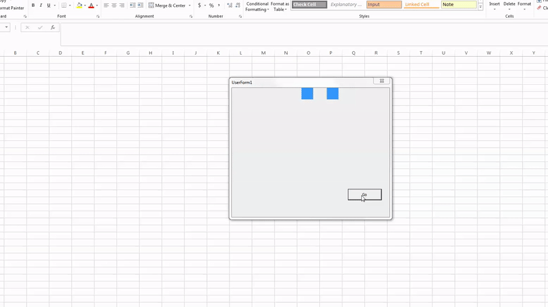

# VBA Userform Transitions and Animations
Tools to have transitions and animations with Userforms and Userform controls
Similar to CSS Transitions and Animations (kinda lol).



# Usage
```vb
'EXAMPLE (IN A USERFORM WITH VARIOUS CONTROLS)
Private Sub GoButton_Click()
    
    'SINGLE EFFECT
    Transition Effect(sidebar, "width", 100, 1000)
    
    'CAN ALSO DO EFFECTS ON USERFORMS
    Transition Effect(Me, "Top", 400, 1000)
    
    'MULTIPLE EFFECTS APPLIED AT ONCE WITH DIFFERENT TIMES AND PROPERITES
    Transition Effect(sidebar, "width", 0, 500) _
             , Effect(box, "Top", Me.InsideHeight - box.Height, 1000) _
             , Effect(box2, "Top", 0, 500) _
             , Effect(GoButton, "fontsize", 4, 1000) _
             , Effect(Me, "Top", 100, 1000) _
    
    'MULTIPLE EFFECTS IN A ROW DO AN ANITMATION EFFECT
    Transition Effect(box, "Left", 0, 250), Effect(box, "Top", 0, 250)
    Transition Effect(box, "left", Me.InsideWidth - box.Width, 250)
    Transition Effect(box, "Top", Me.InsideHeight - box.Height, 250)
    Transition Effect(box, "left", 0, 250)
    Transition Effect(box, "Top", 0, 250)
    
End Sub
```


# Public Methods/Functions
- Transition
- Effect
- MicroTimer

# Private Methods/Functions
- AllTransitionsComplete
- TransitionComplete
- IncrementElement
- easeInAndOut

# TODO:
- Change The Way That The Effect Is Called, That Way There Might Be An Option Of What Type Of Effect, Such As Liner, Ease-Out, Ease-In, Possibly Even Bezier Curve.

- Need To Add A Function For Finding The Userform For Refresh, Currently Just Grabs It From The First Element That Is Added. Works For Now, But Not Very Dynamic.


- Currently Have A Sleep Hardcoded, Should Look Into Testing Different Things To See If It can Help Reduce Flashing. Again, Works For Now, But Should Be A Better Way.


